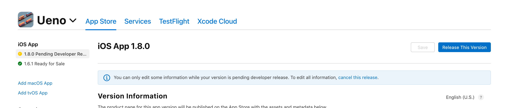

# A Collection of Mobile App Store Quirks

[](https://github.com/tramlinehq/store-quirks/blob/master/LICENSE) 
[](https://discord.gg/u7VwyvBV2Z)


# What is this?

As mobile developers, we face unique challenges when it comes to releasing and managing updates for our apps across different app stores. One of the primary reasons for this difficulty is the scattered and insufficient documentation available, which lacks the necessary level of detail and nuance to provide a clear understanding of the process.

Additionally, the interfaces and tools provided by these stores for managing releases are often opaque and and don't offer much insight into how things work behind the scenes, which further complicates the process.

This reference is a compilation of answers for common and rare situations in an attempt to increase transparency. It is compiled from experience, developer forums, Stack Overflow, and various other sources of developer documentation. We hope contributions from other developers will grow this resource further.

> **Note:** A few of these might seem obvious, but they exist to draw a contrast between the stores.

### Jump to: [App Store](#apple-app-store) • [Play Store](#google-play-store)

# Glossary

This is a quick definition check for commonly used words across stores so that we don't end up using them loosely or interchangeably:

| | App Store | Play Store |
|-|-----------|------------|
| Version Name | [Bundle Short Version String](https://developer.apple.com/documentation/bundleresources/information_property_list/cfbundleshortversionstring). The release or version number of the bundle. String on the right: <br/>  | [This](https://developer.android.com/studio/publish/versioning#versioningsettings) is `versionName`. Unlike App Store, it doesn't need to be a semver-style string; it can be anything. This is what is shown to the users on the store page. |
| Version Code | [Bundle Version String](https://developer.apple.com/documentation/bundleresources/information_property_list/cfbundleversion) (a.k.a. build string). The version of the build that identifies an iteration of the bundle. This number is the one generally incremented through a CI pipeline. Note that this technically needn't be an integer, it just needs to be incremented every time. Number on the left: <br/>  | [This](https://developer.android.com/studio/publish/versioning#versioningsettings) is `versionCode`. Unlike App Store, it is not a string, it is a pure integer that must be incremented for every new build. |
| Release Version | This is typically the Version Name (but it can be different). In the APIs, you'd find this under [PreReleaseVersion](https://developer.apple.com/documentation/appstoreconnectapi/prereleaseversion/attributes) and/or [App Store Version](https://developer.apple.com/documentation/appstoreconnectapi/appstoreversion/attributes). This is what is shown to the users on the store page. | This is typically the Version Name, but can be different. This is only for internal use and isn't shown to users anywhere. |

---

# Apple App Store

## Fastlane

When using [Fastlane](https://fastlane.tools), if `skip_app_version_update` is set to `false` (default), the following two things will happen:

* Creating a new build on TestFlight will auto-create a new release in `READY_FOR_SUBMISSION` on App Store (production).
* If there's already an `inflight` release, a new build on TestFlight will **not** auto-update the build under the `inflight` release, but, it will change the release version name to the new one.

Set the flag to `true` to disable the above.

## Does the previous Ready For Sale in phased release automatically halt or stop when a new one is attempted for distribution after approval?

If the phased release was paused: the older version moves to `REPLACED_WITH_NEW_VERSION` status with its phased release as `COMPLETE` after a new version is released.

If the phased release was active: _same as above_.

## When can you create a new release for an app?

You can only do this when the last release is in `READY_FOR SALE` (it has been released to at least some users, phased or full) or `DEVELOPER_REMOVED_FROM_SALE`.

Ref: [https://developer.apple.com/help/app-store-connect/update-your-app/create-a-new-version](https://developer.apple.com/help/app-store-connect/update-your-app/create-a-new-version)

## What is `DEVELOPER_REMOVED_FROM_SALE` and how do you get to that state?

This state is reached when you have completely removed your app from the store. You can do this by going to the "Pricing and Availability" section in the App Store Connect dashboard and setting the availability to "Remove from sale". This will remove the app from App Store for all regions. Please refer to the screenshot below:


## Can you revert to an older version of the app if the current version (being phased) has a bug?

No, it is not possible to revert to a previous version on the App Store if you have an issue with your app. You must create and submit a new version.

Ref: https://developer.apple.com/help/app-store-connect/update-your-app/create-a-new-version

## During a phased release, what version is presented to users downloading for the first time?

Phased rollout is only for automatic updates, new users will always download the latest build. Existing users can also go and manually update the build from the App Store.

From https://developer.apple.com/help/app-store-connect/update-your-app/release-a-version-update-in-phases:

> Keep in mind that apps and app updates in phased release can be manually downloaded from the App Store by anyone at any time.

## How does the release of a version update work during a phased release?

For example, will version 2.0.1 be released only to the same 2% of the users that already received version 2.0.0? Or it will be delivered to a completely new 2% of my users?

It will be delivered to a completely new random sample of 2% users, no correlation.

## Is there a way to halt a phased release?

In a way, yes. A release can be paused any number of times during a phased rollout, but the halt is immediate and that version is removed from the store right away. Halt will not be able to do anything about the users who already received the update.

From https://developer.apple.com/help/app-store-connect/update-your-app/release-a-version-update-in-phases:

> While your app is in phased release, you can choose to pause the release for a total of 30 days.
> There’s no limit to the number of pauses.
> 
> If you remove your app from sale, phased release will stop and won’t be available for that version again.

You can make that version available again by flipping the switch. It can take some time to become available again. See [What is DEVELOPER_REMOVED_FROM_SALE and how do you get to that state?](#what-is-developer_removed_from_sale-and-how-do-you-get-to-that-state)

## Can you start a new release (start its distribution) while another release is in a phased release?

Yes. See [Does the previous Ready For Sale in phased release automatically halt or stop when a new one is attempted for distribution after approval?](#does-the-previous-ready-for-sale-in-phased-release-automatically-halt-or-stop-when-a-new-one-is-attempted-for-distribution-after-approval)

## Can you start a new release (start its distribution) while another release is in phased release, but paused?

Yes. See [Does the previous Ready For Sale in phased release automatically halt or stop when a new one is attempted for distribution after approval?](#does-the-previous-ready-for-sale-in-phased-release-automatically-halt-or-stop-when-a-new-one-is-attempted-for-distribution-after-approval)

## How long can you shepherd a phased release?

Upto 30 days, after which the build is removed. 

## How long are non-production builds retained for in TestFlight?

They expire after 90 days.

## What happens to the phased release when it is paused and the 30 day time limit has passed?

Currently uncertain.

## Until what state can you remove a release from review, or cancel it?

You can remove a release from review even after the build is `In Review`. You can cancel a release after approvals and before a Developer Release.




## Can I update a build on a running phased rollout?

You can’t do this because there is no UI for it on the App Store Connect dashboard.

If you try to do this using the API, you get the following error:

```
A relationship value is not acceptable for the current resource state.
The specified pre-release build could not be added.
```

Also from https://developer.apple.com/help/app-store-connect/manage-builds/choose-a-build-to-submit:

> However, you can change the build as often as you want until you submit the version to App Review.

Also see: [Can you revert to an older version of the app if the current version (being phased) has a bug?](#can-you-revert-to-an-older-version-of-the-app-if-the-current-version-being-phased-has-a-bug)

## Can I update a build after a release has been reviewed but has not been released to users (not in `READY_FOR_SALE`)?

This cannot be done. The build can only be updated before submission for review, after which you have to explicitly cancel the release and make a new one to be able to change builds.


---

# Google Play Store

## Can I update a build on a running staged rollout?

Play Store allows you to create a new release on the Production track while another is being rolled out. It immediately sets the current release to be in a `Not Live` state when the new one is promoted to be the live release.

## During a staged rollout, what version is presented to users downloading for the first time?

New users also participate in the randomization off of the release % bucket.

## How does the release of a version update work during a staged rollout?

For example, will version 2.0.1 be released only to the same 2% of the users that already received version 2.0.0? Or it will be delivered to a completely new 2% of my users?

From https://support.google.com/googleplay/android-developer/answer/6346149?hl=en:

> When you do a staged rollout of a new release before completing the rollout of the previous release, the new release will use the same group of users as the previous release (depending on the percentage of the rollout).

In the Play Store, depending on the percentage rollout, the user group is sticky with respect to the selection from the previous release.

## How long can you shepherd a staged rollout?

Indefinitely.

## How long are non-production builds retained for in the App Bundle Explorer?

Indefinitely.

# Help and contribution

If you have a correction, a question, or an answer to a question that you’d like to submit, please [create an issue](https://github.com/tramlinehq/store-quirks/issues)! Feel free to drop in to our [Discord community](https://discord.gg/u7VwyvBV2Z) if you'd like to chat.
